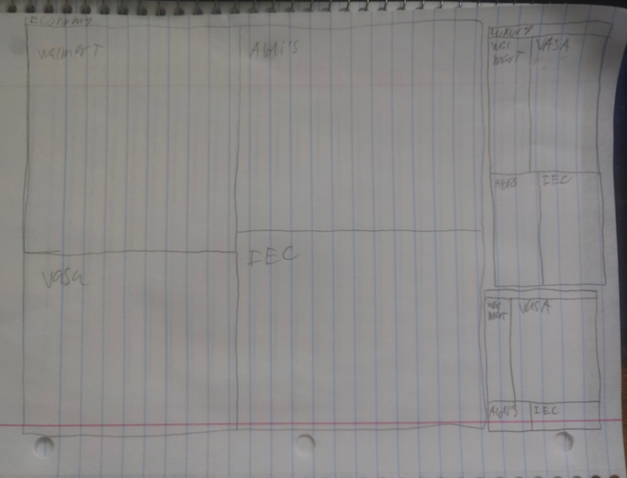
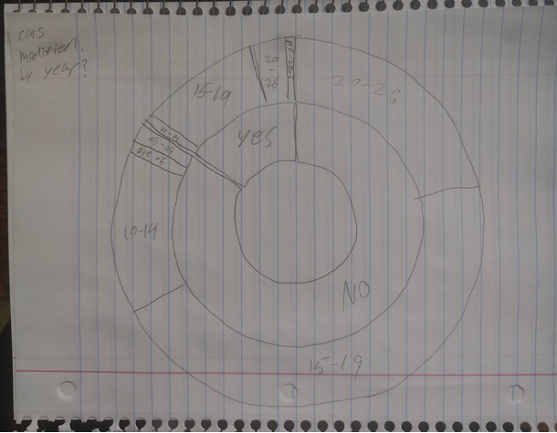
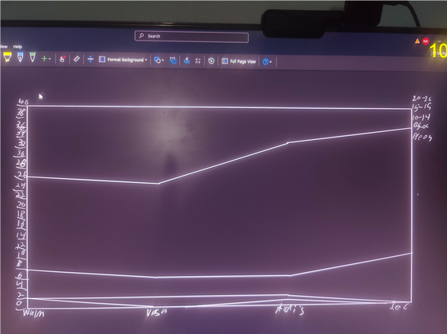
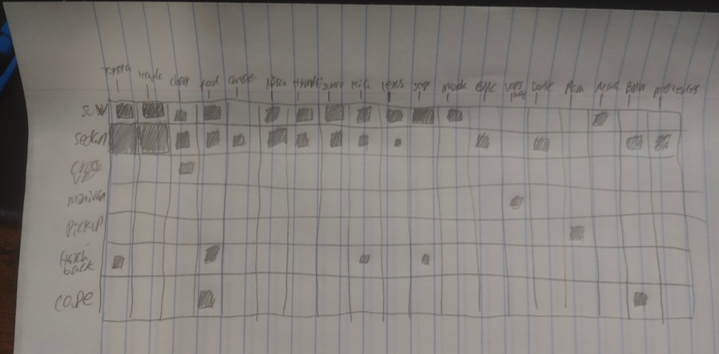

# CS 424 Assignment 1

## Task 1: Observation and Data Collection Plan

### Topic Generation

Idea generation:
What do I like? What am I interested in?
Games
Art
Cars
Swordsmanship
Martial Arts (Specifically kickboxing which is what I’m most proficient in)

What would be easiest to observe in the physical world?
…
Definitely cars.

What data would I collect?
Date
Day of the Week
Time
Location
Weather
Make
Model
Car Type
Color
Approximate Year Range
Modified (Y/N)
Mod Type (None, Spoiler, Tint, etc)
Vehicle Class (Econ, Luxury, Performance)
(Well actually mod type and Modified would be redundant, cuz if it’s not modified it’ll just be None for mod type, but maybe it makes sense? Hmm… think about this later.)

Do these attributes record variability? I’d say yes. This is because we can capture a range of different Dates, Times, Locations, and Weather. Whether or not we find some kind of correlation between these variables and things like Car type, Color, Year range, etc, we’ll find out in the test observation stage.

### Initial Domain Questions
1. How does the distribution of vehicle types vary by location?
2. Are older vehicles more likely to be modified than newer ones?
3. Do certain brands have greater color variation between models?
4. How does the distribution of Car Class vary by Car Make?

Of course if there isn’t anything interesting, I can always come back and change these questions.

### Collection Procedure
What constitutes one observation?
One car recorded in the location’s parking lot is one observation. 

What attributes will you record for each observation?
Listed in the table above.

Where and when will you collect the data?
Near/around my neighborhood, and downtown Chicago

Over how many locations, times, or days will you collect it?
Over 4 days. Saturday, Sunday, Monday, Tuesday. Locations will be broken down into parking garages, Malls, Gyms, etc. This will be up to my discretion and really is going to be more-so that I can make localized comparisons between locations I think would have actual variance.

How will you ensure that your data captures meaningful variation rather than a single snapshot?
First, choosing different types of locations. Such as a gym, a local plaza, a community center. Then the different times of day and days of week capture varying activity levels. Ideally this captures car distributions across meaningfully different conditions. Also, when choosing data, I will assign each car a number between (1, number of cars), so that observations are easier to talk about.

How will you decide what to observe?
There’s only so much that’s visible when observing a car. Encompassing most of the physical attributes of the car is where the bulk of the valuable data lies, plus that’s mostly what we can see anyway. The environment the cars are in will help us connect the car data to the environment and find correlations.

How will the collection be divided among group members?
Just me, since I’m doing this solo.

What might your collection process fail to capture?
It might fail to capture the distribution of cars at night, since most of my observations will be made in the day.

How might your collection process introduce bias?
The collection process will be done in the Chicagoland area, specifically Glendale Heights/Lombard. This means any influencing factors unique to the region (like income, car culture, etc) will be harder to spot, since there won’t be observations from outside that region to compare to. Also since I’m choosing the places that I’M interested (since one person can’t possibly hope to capture ALL the cars in their area via manual entry), some places, like grocery stores, might be more likely to have SUVs simply because they are  more practical for storing groceries, or maybe Home Depot has more pickup trucks because the overlap between people going to home depot and people who have pickup trucks is noticeable. 

### Data Dictionary

| Attribute | Type | Description | Example |
|---|---|---|---|
| Location | Categorical | Location observed | Lombard Walmart, Roselle Metra |
| Time | Temporal | Time observed | 6:24 PM |
| Day of the Week | Categorical | Day of Week of observation | Monday, Tuesday |
| Date | Temporal | Date Observed | 10/4, 11/1 |
| Weather | Categorical | Weather when observed | Partly Cloudy, Sunny |
| Make (brand) | Categorical | Make (brand) of car | Toyota, BMW |
| Model | Categorical | Model of car | Traverse, ES250 |
| Car Type | Categorical | Type of car | SUV, Hatchback |
| Color | Categorical | Color of car | Black, Red |
| Approximate Year Range | Ordinal Categorical | Estimated year interval of car | 2016-2020, 2020-2021 |
| Modified (Y/N) | Binary Categorical | Aftermarket mods? (Visible) | Yes, No |
| Mod Type | Categorical | Modification type | Tint, Multiple |
| Vehicle Class (3 kinds) | Categorical | Class of Vehicle | Economy, Luxury, Performance |

---

## Task 2: Pilot and Data Collection

### Pilot
| # | Location | Time | DoW | Date | Weather | Make | Model | Car Type | Color | Year Range | Mod | Vehicle Class |
|---|---|---|---|---|---|---|---|---|---|---|---|---|
| 1 | 7/11 Parking Lot | 2:22 PM | Friday | 9/25 | Partly Cloudy | Honda | Accord | Sedan | Gray | 2005-2009 | None | Economy |
| 2 | ~ | ~ | ~ | ~ | ~ | Ford | Escape | SUV | Dark gray | 2010-2014 | None | Economy |
| 3 | ~ | ~ | ~ | ~ | ~ | Subaru | Crosstrek | SUV | White | 2020-2024 | None | Economy |
| 4 | ~ | ~ | ~ | ~ | ~ | Nissan | Altima | Sedan | Dark Gray | 2015-2019 | None | Economy |
| 5 | ~ | ~ | ~ | ~ | ~ | Toyota | Camry | Sedan | White | 2010-2014 | None | Economy |
| 6 | ~ | ~ | ~ | ~ | ~ | Ford | Edge | SUV | Black | 2010-2014 | None | Economy |
| 7 | ~ | ~ | ~ | ~ | ~ | Toyota | Venza | Wagon? SUV | Silver | 2010-2014 | Tint, LED | Luxury |
| 8 | ~ | ~ | ~ | ~ | ~ | Honda | CRV | SUV | White | 2020-2024 | None | Economy |
| 9 | ~ | ~ | ~ | ~ | ~ | Toyota | RAV4 | SUV | White | 2015-2019 | None | Economy |
| 10 | ~ | ~ | ~ | ~ | ~ | Hyundai | Santa Fe (Limited Trim) | SUV | Red | 2005-2009 | None | Luxury |

### Changes After Pilot
Most attributes were clear and easy to record, though color was debatable, so was year range. Since I’m doing this solo, there’s not many ways to interpret the attributes differently. (The voices in my head might beg to differ.) I believe I’ve captured a lot of important data regarding the physical attributes of the observed cars, as well as enough environmental data to try and create correlations. A binary Modification category (Y/N) felt sort of redundant, but I think it’s for the best if I keep it. The pilot reinforced the idea that my original questions should be answerable with the data. Whether more interesting questions will arise is a different story.

### Collection Procedure
I will collect observations of parked vehicles at several local public parking areas representing different destination types, such as a big-box store, grocery store, gym, shopping center, and restaurant area. One observation will represent one parked vehicle. I will take videos of a parking lot, then scrub through the video, select a random row, collect all observations, repeat until I have 20 observations from said parking lot. I will do this 8 times, collecting observations from the same location twice, separated by a full day interval, once at 10-11 AM and then again at 3-4 PM, to capture meaningful variation across time and space. The selection of random rows is meant to reduce cherry picking rows that have more interesting cars and to make the sampling process more consistent. I will not record license plates, faces, names, or any information that could identify the owner. I’m not sure how to approach uploading the raw data, since the video will inevitably contain personally identifiable information. It is unfortunately possible and even likely that I may miscategorize a car’s make/model/approx year range. 

### When was data collected:
I’m going to be honest, it depended mostly on my free days. I’m busy during most of the week, and Saturday, Sunday, Monday, Tuesday were the only days I was able to actually set aside for data collection. 

### Where was data collected:
I basically had a list of places and put them in a spin the wheel website, then I spun the wheel 4 times and out of the 10 places, I selected the first 4 options I spun. This was to keep my selection randomized and to prevent me from cherry picking places that I thought would have greater juxtaposition with each other. Those being my local Walmart, Aldis, Community Center, and VASA gym. I was limited to areas I had immediate access to. Chalk it up to my social anxiety but I really didn’t want to be seen going around Chicago parking lots filming cars… I mean I know if I saw someone doing that I’d be a little disturbed.

### How was data collected:
Data was collected via video format. I then scrubbed through the videos left to right, and recorded the data for each observation (car). I also didn’t count cars that I was unsure of regarding Make/Model since sometimes a car got cut off, was blurry, etc. I then selected the first 20 observed cars per video, this is so I wouldn’t cherry pick interesting cars. Overall, I took 8 videos. 4 locations, 2 videos each, recorded on either Interval 1 (Monday Tuesday), or Interval 2 (Saturday Sunday), 10 AM or 3 PM. I drew lots for each video recording interval with replacement, leading to only one location being observed on the weekends. While I wasn’t particularly happy about it, I decided to keep it this way since I would have Walmart on a weekday and Aldis on a weekend, leading to greater variability even if comparability was diminished. (Is that cherry picking? I dunno, but I would wager no since intervals were selected randomly.)

### Relevant raw data:
Uploaded to Github

I just realized the videos contain license plates which is a no go, so not sure what to do now.

### Final Data Dictionary
| Attribute | Type | Description | Example |
|---|---|---|---|
| Location | Categorical | Location observed | Lombard Walmart, Roselle Metra |
| Time | Temporal | Time observed | 6:24 PM |
| Day of the Week | Categorical | Day of Week of observation | Monday, Tuesday |
| Date | Temporal | Date Observed | 10/4, 11/1 |
| Weather | Categorical | Weather when observed | Partly Cloudy, Sunny |
| Make (brand) | Categorical | Make (brand) of car | Toyota, BMW |
| Model | Categorical | Model of car | Traverse, ES250 |
| Car Type | Categorical | Type of car | SUV, Hatchback |
| Color | Categorical | Color of car | Black, Red |
| Approximate Year Range | Ordinal Categorical | Estimated year interval of car | 2016-2020, 2018-2021 |
| Modified (Y/N) | Binary Categorical | Aftermarket mods (Visible) | Yes, No |
| Mod Type | Categorical | Modification type | Tint, Multiple |
| Vehicle Class | Categorical | Class of Vehicle | Economy, Luxury, Performance |

### Final Data Collection
- Total observations: [160]
- Locations: [4]
- Days: [8]
- Times: [8]

[View full dataset](Cars.csv)

---

## Task 3: Data Description and Domain Questions

### Dataset Description
The final dataset contains 160 cars, or observations, and 13 attributes. I collected 40 vehicles at each of four locations: Walmart, VASA Fitness, Aldi’s and the IEC Community Center. The observations were collected across six dates, covering Monday Tuesday Saturday and Sunday. Observations were collected once at 10 AM and then again at 3 PM, on different days. For example if one set of observations was collected on Monday 10 AM, the 2nd set would be collected on Tuesday 3 PM. This gives spatial and temporal variation, allowing us to observe a greater variety of distributions. The dataset has 19 different Makes (brands), Spanning 61 different models, 7 vehicle types, 5 year-range approximations, and 3 vehicle classes (determined by brand marketing, ex: a Mazda CX5 is typical advertised as a luxury/comfort vehicle, whereas a Ford Mustang is typically advertised by the company as a performance/sport vehicle, boasting high acceleration.) Sedans and SUVs comprised the vast majority of observations, with 69 Sedans and 58 SUVs out of 160 total cars, ~80% of the cars were either Sedans or SUVs. 90/160 (~56%) of vehicles were aged approx 2015-2019, and ~25% of vehicles were aged 2020-2026. One flaw with the way I approached data collection and categorization was because my year ranges are approximations, there is a good chance that a 2019 car could be a 2020 model. This is mainly because car manufacturers in the US saw a significant design shift in 2018, and many 2019-2021 cars, when grouped by Make/Brand, have similar design aesthetics, making them harder to distinguish. Also, whether or not certain SUVs are crossovers with hatchbacks, since many companies (Ford being a prime example) have started creating these frankenstein hatchback designs that could easily count as an SUV if you squint hard enough. I considered going back and changing certain observations because of this, and this also makes hatchbacks rarer than maybe they should be in my dataset since I might have been more likely to categorize a modern hatchback as an SUV crossover instead. These factors may have introduced some classification error or bias into the dataset. 

### Reflection
Most of the information observed was physical, and regarding the cars themselves. I would be unable to make any assumptions about the owners of the cars, like race, gender, age, etc. Nor would I be able to come to any conclusions regarding the internals of the car, its actual performance, or its interior. Some information was lost because real vehicles are more complex than the categories I used. For example, exact model years were simplified into broad ranges, modification status was reduced to visible yes/no categories, and some cars could reasonably fit into more than one body type or class. I also chose to make each individual vehicle one row in the dataset, which made it easier to compare cars across locations and categories. Some values required personal/subjective judgment, especially like I said earlier, estimating year range and deciding whether something counted as a modification or simply a variation of the stock car build.

### Final Domain Questions
1. How does the age distribution of vehicles differ across locations?
2. Which Makes(brands) are more associated with particular car types?
3. Are modified cars concentrated within certain year ranges, classes, or locations?
4. How does the distribution of vehicle class vary across locations? 

These questions are slightly different from my previous domain questions. The main things I realized were; trying to gauge car class via Car Make doesn’t make much sense, since a majority of Luxury and performance cars are made by brands that specialize in Luxury or performance. This means the data would lead to an obvious conclusion, Luxury cars are usually made by luxury brands, performance cars are made by performance brands. That’s not particularly interesting. Another concept I realized was I was more interested in figuring out distribution of vehicle class by location than I was interested in type by location, because I believe class will be a greater indicator of the types of people who come to each location. I have a personal belief that older cars are more likely to be modded because “hardcore” car enthusiasts tend to shun modern car design philosophies, and there’s a huge element of nostalgia amongst this group, therefore they’re more likely to mod older cars. I am curious to see if my collected data arrives at a conclusion regarding this. I will explain my goals behind these questions more in task 4.

---

## Task 4: Task Abstractions

### Question 1
- Domain Question: How does the age distribution of vehicles differ across locations?
- Action: Compare
- Target: Distribution of vehicle year ranges across locations.
- Abstract Task: Compare vehicle age approximations across different locations.
- Reasoning: This question is mainly about comparing how old or new the vehicles are at each location. Since the year ranges have a natural order, the goal is to compare the distribution of those ordered categories between locations rather than just identify one single value. This lets us see if certain locations contain a higher percentage of newer or older cars compared to others, and is the main reason I’m answering this question.

### Question 2
- Domain Question: Which makes (brands) are more associated with particular car types?
- Action: Identify Correlations
- Target: Association between vehicle make(brand) and car type
- Abstract Task: Identify and compare relationships between two categorical attributes, in this case car make and type.
- Reasoning: My goal is to see whether certain brands appear more often with certain vehicle types, such as whether one make is mostly associated with SUVs while another appears more often as sedans. Toyota’s famous for the Corolla and Camry, which are both sedans. I want to know if this has any impact on if, for example, a greater percent of Toyotas observed are sedans, compared to Fords, which might have a greater proportion of trucks than other brands.The abstraction helped us see that the main goal is finding associations between categorical variables.

### Question 3
- Domain Question: Are modified cars concentrated within certain year ranges?
- Action: Identify Correlations
- Target: Distribution of modified vehicles across year ranges
- Abstract Task: Identify where modified cars are concentrated across year ranges.
- Reasoning: This question focuses specifically on the modified cars and asks whether they appear more frequently in certain year ranges. The goal here is to see if there’s a pattern between the year range of a car and the statistical likelihood that it will be modified.

### Question 4
- Domain Question: How does the distribution of vehicle class vary across locations?
- Action: Compare
- Target: Distribution of economy, performance, and luxury vehicles across locations
- Abstract Task: Compare the composition of vehicle class across locations.
- Reasoning: The goal is to compare the proportions or frequencies of vehicle classes at each location. I’m comparing how the overall composition of vehicle classes changes from place to place. This abstraction is about categorical composition across different groups and whether or not there is any correlation between them.

---

## Task 5: Visualization Sketches

### Sketch 1

- **Question/Task:** How does the distribution of vehicle class vary across locations?
- **Attributes:** Location, Vehicle Class
- **Marks:** Rectangles
- **Description:** In this Treemap there are 3 main rectangles/bins. For context the treemap is broken down as Car Class by Location. The 3 main bins are car class, and within those bins is a visual representation of the proportion of that bin each car has. Rectangle size represents the number of vehicles, while grouping and position separate vehicle classes and locations. The treemap makes it easy to see that economy vehicles make up most of the dataset, and it also makes it pretty clear that we can find a higher proportion of performance cars at VASA than at any of the other locations. Unfortunately, because humans are bad at reading areas, the smaller differences seen in the Luxury and Economy bins are harder to compare because of how similar the size of their rectangles seem. It's also difficult to compare exact values between locations because the rectangles do not share a common axis. 

### Sketch 2

- **Question/Task:** Are modified cars concentrated within certain year ranges?
- **Attributes:** Modified, Year Range
- **Marks:** Arc segments
- **Description:** In this Sunburst Diagram, Angle and arc length represent the number of vehicles. The inner ring separates modified and non-modified vehicles, while the outer ring shows the year ranges within each group. Here, we can see that the vast majority of cars are unmodified and that less than 1/4th of all cars observed are modified. When we look into the sub-segments of the Yes category, we can easily see that the majority of modified cars range from 2015-2019. However, the smaller year-range segments are difficult to read and compare and the circular layout also makes exact comparisons harder than a visualization using a common axis.

### Sketch 3

- **Question/Task:** How does the age distribution of vehicles differ across locations?
- **Attributes:** Location, Year Range
- **Marks:** Areas
- **Description:** In the stacked area chart, Horizontal position represents location, vertical height represents the number of vehicles, and separate stacked areas represent the different year ranges. The way to read this graph is that the line inbetween the areas shows the proportion of each car type. For example we can see that from VASA to Aldi's, the '15-'19 slope goes up, meaning there are proportionately more '15-'19 range cars at Aldis than at VASA. Because the year ranges are stacked, categories in the middle are harder to compare across locations since they do not share the same baseline. The visualization can also make small differences difficult to notice, like with Pre-2005 cars and '05-'09 cars.

### Sketch 4

- **Question/Task:** Which makes (brands) are more associated with particular car types?
- **Attributes:** Make, Car Type
- **Marks:** Squares/rectangles
- **Description:** In this Matrix grid, Horizontal position represents vehicle make, vertical position represents car type, and the size of each square represents how frequently that make and car type combination appears. We can easily see that the frequency of Sedans and SUVs is greater across the board, when compared to more niche car body types like Coupes and Hatchbacks. We can also see that a large portion of Toyota and Honda's cars are Sedans and SUVs. In this way, the matrix makes it easy to identify relationships between brands and vehicle types as larger squares quickly show which combinations appear more frequently. The problem is There are many vehicle makes, which makes the labels crowded and difficult to read (that and also my terrible handwriting). Makes with very few observations can also be difficult to notice because their squares are very small, like the single godforsaken bright green Kia Rio4 I saw while recording. 

---

## Task 6: Summary

[Compare the sketches.]
- **Sketch comparisons:** So, since my drawings look like a dementia patient's, I decided to add images of what the actual graphs should look like. Anyways, the biggest thing I noticed between all my sketches was the idea of bins. Now, yes, something like a bar graph or time series has bins, but I realized that all of my graphs have really obvious bins and sub-bins, and that made observing them pretty easy even though my drawings of them all were absolutely terrible. Perhaps the most removed from this idea was the frequency matrix, since it's really just a fancier looking pivot table. However one thing thing that I really wanted to focus on was the fact that the all of these graphs utilize **AREA**. We learned about this idea of what makes graphs interpretable/readable. As discussed in the textbook, and also in my CS 418 class, the human eye is really good at identifying colors, and **position**. This is because evolution has proven that being able to distinguish these two things increases our chance of survival. Red and bright colors signal toxicity, and obviously the position of something helps us distinguish the chances that we could capture it, or that it might capture us. Because of this, humans have become well adapted to differentiating these two things. The same can not be said for area. Humans are famously bad at percieving changes in area, and for good reason. There are very few moments where understanding miniscule changes in the size of something could be considered evolutionary advantage. Therein lies the greatest flaw of all my visualizations. Because they all rely on size, only BIG differences in size are noticeable. Despite this, there is one positive aspect of the fact that these visualizations are sized based, and that is that psychologically they draw you to the biggest differences. For example in the Sunburst diagram, your eyes are immediately drawn to either the small yes circle segment, or the big no circle segment. Either case gives immediately important information. The vast majority of cars are unmodded. Then within the Modded sigment, you can easily see that most modded cars' year range is '15-'19. This is arguably superior to viewing this same information on something like a scatter plot, where you are required to analyze the position and general shape of the distribution, and then look at the axis for further info.

- **Things I would've done differently:** My biggest takeaways are that graphs are not objective. They are inherently full of bias, and this bias can be their intentionally. I purposefully chose Area graphs with immediately striking features, because my intention was to make the graphs interesting. There was rhetoric behind the graphs. I wish I would've collected the data differently, like maybe taking more pictures instead of videos, or getting consent from the store/lot so I wouldn't feel like a criminal surveying people's cars.

---

## Task 7: Collaboration Process

- It was just me, so I'm not really sure how I would answer this.

---

## Files

- [Cars.csv](Cars.csv)
- [Cars.xlsx](Cars.xlsx)
